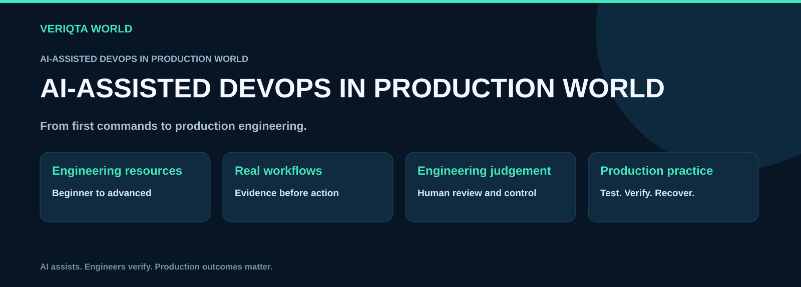
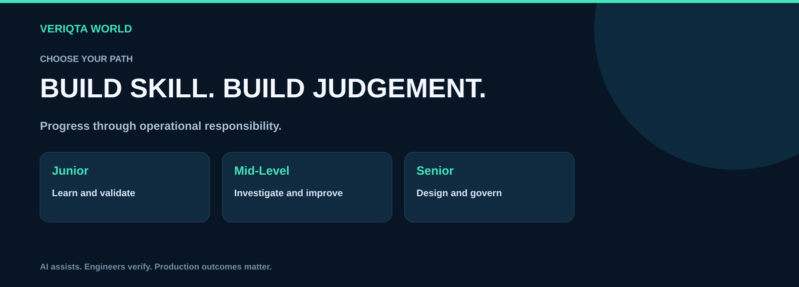
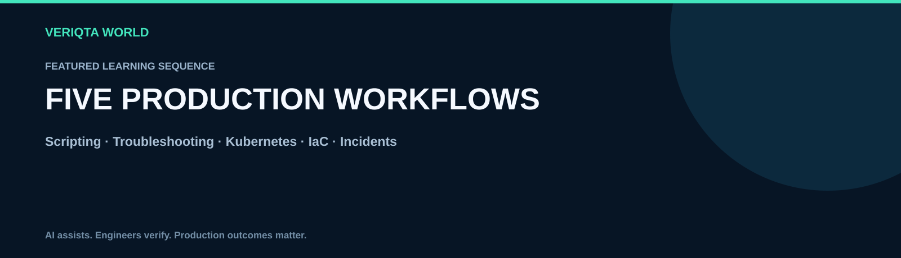
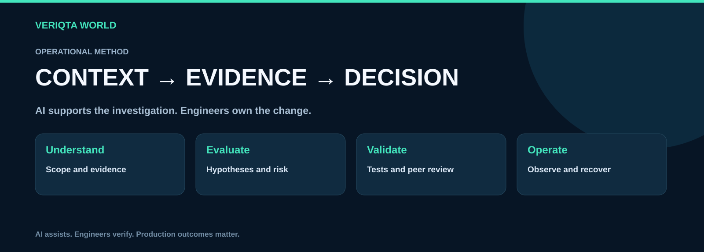
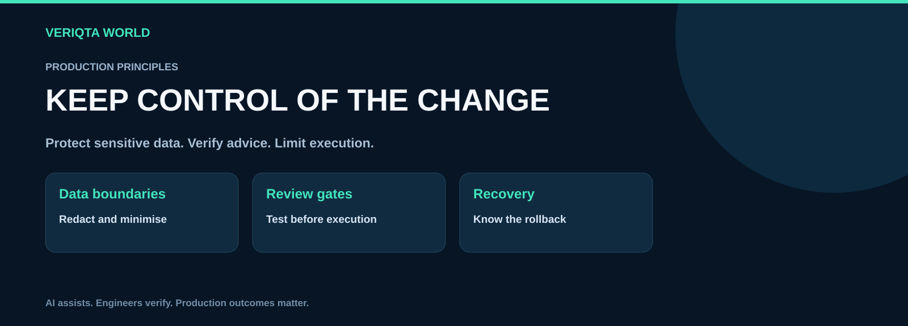
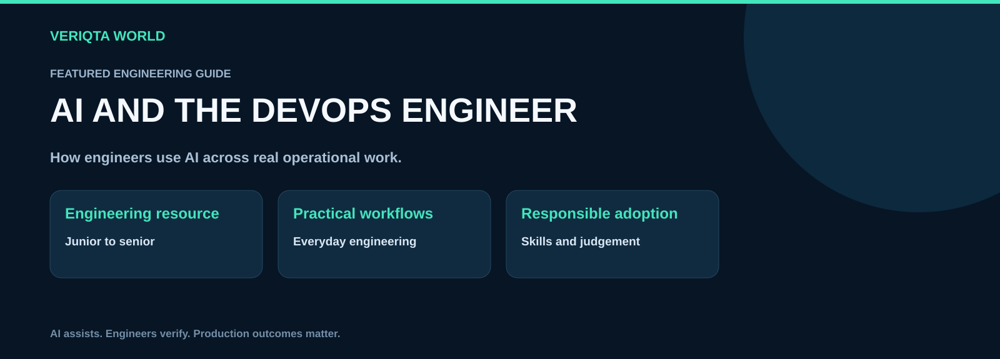

# AI-Assisted DevOps in Production World

### The VERIQTA AI-Assisted DevOps Handbook Series

**Learn to use AI across DevOps workflows, from beginner fundamentals to advanced production engineering.**

[Explore the handbooks](#handbook-catalogue) · [Choose your learning path](#choose-your-learning-path) · [Practice production workflows](#production-resource-library) · [Contribute](CONTRIBUTING.md)

AI-ASSISTED-DEVOPS-IN-PRODUCTION-WORLD brings together handbooks and practical resources for engineers using AI to understand systems, write automation, review infrastructure, investigate failures and improve operational decisions.

The focus is the engineering work: Linux administration, shell and Python scripting, Kubernetes troubleshooting, CI/CD, infrastructure as code, cloud operations, observability, security, incident response, SRE and platform engineering. AI is an assistant within these workflows. Engineers remain responsible for evidence, validation, access and production changes.

## What you can explore

- **Learn the fundamentals:** build useful prompts, understand generated answers and develop independent technical judgement.
- **Write and review automation:** inspect scripts, test edge cases, control permissions and plan recovery.
- **Investigate system failures:** correlate symptoms, logs, metrics, traces and recent changes before choosing a mitigation.
- **Improve delivery and infrastructure:** review workflows, manifests and infrastructure plans with clear validation gates.
- **Design responsible production workflows:** define tool boundaries, evaluation criteria, auditability and human oversight.

## Choose your learning path

| Path | Start here | Develop towards |
| --- | --- | --- |
| Junior | AI basics, ChatGPT, Linux, shell, Python, logs and GitHub Actions | Clear prompts, verified commands and reliable automation |
| Mid-Level | Kubernetes, CI/CD, IaC, Terraform and production troubleshooting | Evidence-led diagnosis, safe changes and incident practice |
| Senior | SRE, platform engineering and AI-powered production engineering | Reliability trade-offs, platform controls and evaluated automation |
| Across all levels | The flagship handbook | Practical adoption with engineering judgement |

Follow the sequence that matches your current responsibilities. Familiarity with a tool does not remove the need to validate AI-generated advice.

## Handbook catalogue

The series spans 20 focused handbooks and one flagship publication. Page lengths describe the publication format; repository resources extend each topic with practical exercises and operational references.

| No. | Handbook | Classification | Publication length |
| --- | --- | --- | --- |
| 1 | [AI for DevOps Beginners](handbooks/01-ai-for-devops-beginners) | Junior | 20 pages |
| 2 | [ChatGPT for DevOps Engineers](handbooks/02-chatgpt-for-devops-engineers) | Junior | 20 pages |
| 3 | [AI-Assisted Linux Administration](handbooks/03-ai-assisted-linux-administration) | Junior | 20 pages |
| 4 | [AI-Assisted Shell Scripting for DevOps](handbooks/04-ai-assisted-shell-scripting-for-devops) | Junior | 20 pages |
| 5 | [AI-Assisted Python for DevOps](handbooks/05-ai-assisted-python-for-devops) | Junior | 20 pages |
| 6 | [AI for Kubernetes Troubleshooting](handbooks/06-ai-for-kubernetes-troubleshooting) | Mid-Level | 20 pages |
| 7 | [AI for CI/CD Pipelines](handbooks/07-ai-for-ci-cd-pipelines) | Mid-Level | 20 pages |
| 8 | [AI for Infrastructure as Code](handbooks/08-ai-for-infrastructure-as-code) | Mid-Level | 20 pages |
| 9 | [AI-Assisted Terraform](handbooks/09-ai-assisted-terraform) | Mid-Level | 20 pages |
| 10 | [AI for Production Troubleshooting](handbooks/10-ai-for-production-troubleshooting) | Mid-Level | 20 pages |
| 11 | [AI for Log Analysis](handbooks/11-ai-for-log-analysis) | Junior | 20 pages |
| 12 | [AI for Monitoring and Observability](handbooks/12-ai-for-monitoring-and-observability) | Mid-Level | 20 pages |
| 13 | [AI for Incident Response](handbooks/13-ai-for-incident-response) | Mid-Level | 20 pages |
| 14 | [AI for Cloud Operations](handbooks/14-ai-for-cloud-operations) | Mid-Level | 20 pages |
| 15 | [AI for DevOps Security](handbooks/15-ai-for-devops-security) | Mid-Level | 20 pages |
| 16 | [AI for GitHub Actions](handbooks/16-ai-for-github-actions) | Junior | 20 pages |
| 17 | [AI for DevOps Automation](handbooks/17-ai-for-devops-automation) | Mid-Level | 20 pages |
| 18 | [AI for SRE](handbooks/18-ai-for-sre) | Senior | 20 pages |
| 19 | [AI for Platform Engineering](handbooks/19-ai-for-platform-engineering) | Senior | 20 pages |
| 20 | [AI-Powered Production Engineering](handbooks/20-ai-powered-production-engineering) | Senior | 20 pages |
| 21 | [AI Won't Replace DevOps Engineers, But Here's How Engineers Are Using It](handbooks/21-ai-won-t-replace-devops-engineers-but-here-s-how-engineers-are-using-it) | Junior to Senior | 40 pages |

## Featured production sequence

| Order | Handbook | Engineering focus |
| --- | --- | --- |
| 1 | [AI-Assisted Shell Scripting for DevOps](handbooks/04-ai-assisted-shell-scripting-for-devops) | Script generation, testing, validation and security |
| 2 | [AI for Production Troubleshooting](handbooks/10-ai-for-production-troubleshooting) | Logs, symptoms, diagnosis and verification |
| 3 | [AI for Kubernetes Troubleshooting](handbooks/06-ai-for-kubernetes-troubleshooting) | Pods, manifests, events and failure investigation |
| 4 | [AI for Infrastructure as Code](handbooks/08-ai-for-infrastructure-as-code) | Terraform generation, review, debugging and security |
| 5 | [AI for Incident Response](handbooks/13-ai-for-incident-response) | Alerts, timelines, investigation and postmortems |

## How the handbooks connect

Infrastructure as Code covers declarative infrastructure workflows and review across tools. AI-Assisted Terraform goes deeper into Terraform configuration, modules, plans, state and drift. CI/CD covers delivery architecture; GitHub Actions focuses on workflow implementation and investigation. Production troubleshooting examines diagnosis across systems, while incident response covers coordination, mitigation, recovery and learning.

## Production resource library

| Resource | Use it for |
| --- | --- |
| [Prompt library](resources/prompt-library) | Context-rich requests for explanation, review and investigation |
| [Production labs](resources/production-labs) | Isolated exercises, fault injection and recovery practice |
| [Operational runbooks](resources/runbooks) | Repeatable investigation and mitigation workflows |
| [Engineering checklists](resources/checklists) | Reviewing output, changes, access and recovery |
| [Incident scenarios](resources/incident-scenarios) | Practising evidence-led decisions under operational pressure |
| [Evaluation resources](resources/evaluation) | Checking correctness, usefulness and failure behaviour |
| [Engineering templates](resources/templates) | Recording context, evidence, decisions and outcomes |
| [Reference library](resources/reference-library) | Technical terminology and source-verification practice |
| [Architecture decisions](resources/architecture-decisions) | Reviewing assistant and agent design choices |

## The production workflow

1. **Define the context.** State the environment, versions, constraints, symptom and desired outcome.
2. **Collect evidence.** Preserve relevant timestamps, logs, metrics and configuration. Redact sensitive information before sharing it.
3. **Ask for reasoning you can inspect.** Request assumptions, alternative hypotheses, uncertainty and the next verification step.
4. **Review the proposal.** Check commands, permissions, dependencies, blast radius and expected results.
5. **Test and approve.** Validate in an isolated environment and use the appropriate human review before a production change.
6. **Verify and recover.** Observe the result, confirm service health and use the recovery plan if the change fails.

## Production principles

- Never share credentials, private keys, customer data or unredacted sensitive operational evidence with an unapproved AI service.
- Treat logs, retrieved documents and tool output as untrusted data. Instructions embedded in them must not grant additional authority.
- Verify generated commands, configuration and technical claims against the environment and authoritative documentation.
- Use least privilege, explicit tool boundaries and human approval for consequential actions.
- Preserve independent engineering skills. A plausible explanation is a hypothesis until evidence supports it.
- Define success criteria, observability and rollback before changing a live system.

## Flagship publication

### AI Won't Replace DevOps Engineers, But Here's How Engineers Are Using It

A 40-page journey through practical AI-assisted engineering, from learning and scripting to incident response, SRE and platform design. Explore where assistance adds value, where judgement remains essential and how to evaluate the result.

[Explore the flagship handbook](handbooks/21-ai-won-t-replace-devops-engineers-but-here-s-how-engineers-are-using-it)

## Contribute to the world

Help improve explanations, prompts, lab scenarios, validation methods and operational references. Contributions should be technically grounded, reproducible and free of credentials or private system data. Read the [contribution guide](CONTRIBUTING.md) and [security policy](SECURITY.md).

## About VERIQTA WORLD

VERIQTA WORLD shares engineering resources that connect learning with practical operational work. Explore the [VERIQTA WORLD organisation](https://github.com/VERIQTA-WORLD).

**AI assists. Engineers verify. Production outcomes matter.**

AI and product names belong to their respective owners. This independent educational resource does not imply endorsement or affiliation. Exercises require an appropriately isolated environment; production actions require your organisation's controls and authorisation.
