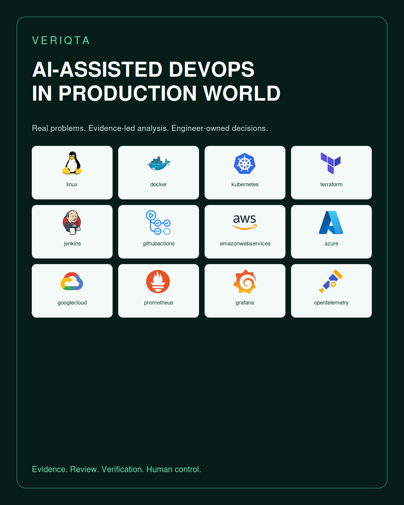
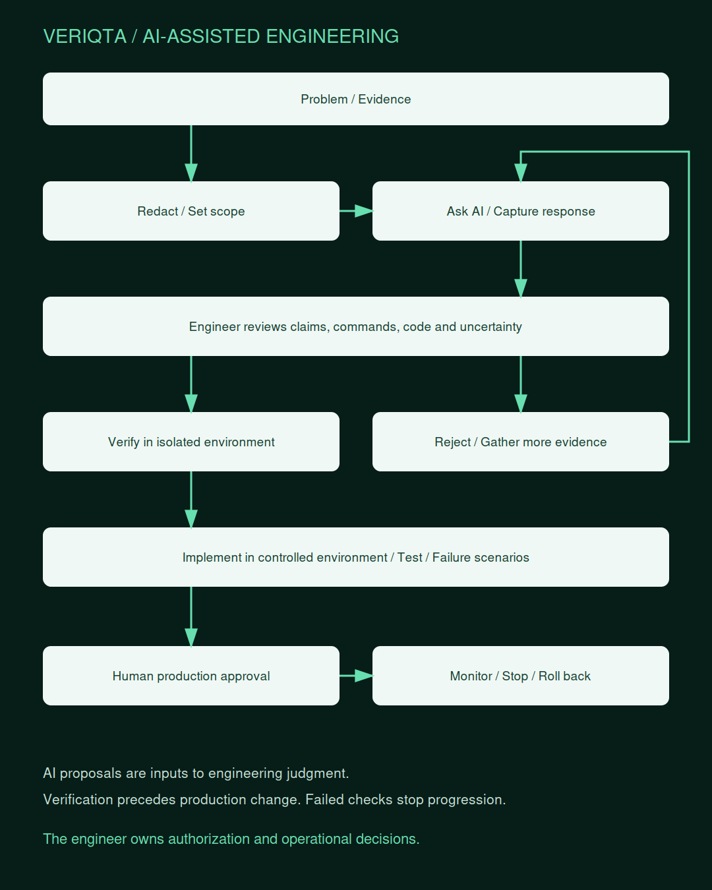

# AI-ASSISTED-DEVOPS-IN-PRODUCTION-WORLD

### Real engineering problems. Evidence-led analysis. Human-owned decisions.

A VERIQTA engineering collection for using AI in DevOps, SRE, platform engineering, and production operations. Learn to frame real problems, select and redact evidence, question AI recommendations, review proposed changes, and verify outcomes before production decisions.

**Scaffold edition.** Public navigation, catalogues, and visual assets are available. The 100 collection folders contain empty outlines and starter exercise structures. Learning notes, examples, labs, projects, AI responses, code, and templates are intentionally empty. Titles such as “50 Problems” and “100 Incidents” describe planned collections, not completed content.

## The engineering workflow

| Stage | Purpose |
|---|---|
| Problem | Define symptoms, impact, constraints, and success criteria |
| Evidence | Gather relevant versions, logs, metrics, configurations, and change history; redact before sharing |
| Ask AI | State the task, allowed actions, limits, and expected output |
| AI response | Capture the answer and model metadata without treating it as verified |
| Engineer reviews | Challenge claims, alternatives, commands, code, and assumptions |
| Verify | Check documentation and reproduce the proposed behavior in an isolated environment |
| Implement | Make the reviewed change in the permitted environment |
| Test | Measure results against acceptance criteria and failure scenarios |
| Production safety | Require applicable human authorization, monitoring, stop conditions, and recovery planning |

## Explore the engineering world

| Section | Topics |
|---|---|
| [00-Start-Here](00-Start-Here/) | How-to-Use, Learning-Paths, Lab-Setup, Scope-and-Status, Evidence-and-Cleanup |
| [01-Beginner-to-Advanced](01-Beginner-to-Advanced/) | Junior, Mid-Level, Senior, Architect, Skills-Checklist |
| [02-AI-Assisted-Engineering-Foundations](02-AI-Assisted-Engineering-Foundations/) | AI-Assistance-vs-Autonomy, Engineering-Ownership, Model-Limits, Confabulation, Uncertainty, Tool-Boundaries, When-Not-to-Use-AI |
| [03-Problem-to-Production-Workflow](03-Problem-to-Production-Workflow/) | Problem, Evidence, Ask-AI, AI-Response, Engineer-Review, Verify, Implement, Test, Production-Safety |
| [04-Evidence-and-Context](04-Evidence-and-Context/) | Problem-Statement, System-Architecture, Versions, Logs, Metrics, Traces, Configs, Diffs, Plans, Timelines, Reproduction, Evidence-Provenance |
| [05-Data-Protection-and-Redaction](05-Data-Protection-and-Redaction/) | Secrets, Customer-Data, Identifiers, Infrastructure-Metadata, State-and-Plan-Sensitivity, Minimization, Retention, Approved-Systems, Redaction-Validation |
| [06-Prompting-and-Interaction](06-Prompting-and-Interaction/) | Task-Framing, Constraints, Hypotheses, Structured-Outputs, Clarifying-Questions, Counterexamples, Iterative-Review, Prompt-Versioning |
| [07-AI-Answer-Review-and-Evaluation](07-AI-Answer-Review-and-Evaluation/) | Claim-Evidence-Mapping, Official-Documentation, Version-Checks, Command-Review, Code-Review, Alternative-Hypotheses, Fabricated-APIs, Evaluation-Rubrics, Regression-Evaluations |
| [08-Human-Control-and-Change-Management](08-Human-Control-and-Change-Management/) | Authorization, Approvals, Blast-Radius, Read-Only-First, Least-Privilege, Two-Person-Review, Stop-Conditions, Rollback, Audit-Trails |
| [09-Sandboxing-Testing-and-Verification](09-Sandboxing-Testing-and-Verification/) | Disposable-Labs, Mocks, Unit-Tests, Integration-Tests, Dry-Runs, Staging, Canary, Acceptance-Criteria, Failure-Injection, Cleanup |
| [10-AI-Tools-Models-and-Access](10-AI-Tools-Models-and-Access/) | Chat-Assistants, Coding-Assistants, Model-APIs, Local-Models, Model-Selection, Versioning, Context-Windows, Cost-Limits, Access-Control, Compatibility |
| [11-Retrieval-and-Knowledge-Systems](11-Retrieval-and-Knowledge-Systems/) | RAG, Runbook-Retrieval, Source-Freshness, Access-Aware-Retrieval, Citations, Document-Poisoning, Index-Lifecycle, Knowledge-Ownership |
| [12-Agents-Tool-Use-and-MCP](12-Agents-Tool-Use-and-MCP/) | Agent-Architecture, Tool-Allowlist, MCP-Integrations, Tool-Output-Trust, Read-vs-Write, Execution-Sandbox, Credentials, Approval-Gates, Timeouts, Kill-Switches |
| [13-AI-Security-and-Threat-Modeling](13-AI-Security-and-Threat-Modeling/) | Prompt-Injection, Indirect-Injection, Excessive-Agency, Data-Exfiltration, Supply-Chain, Poisoned-Logs, Malicious-Repositories, Output-Handling, Security-Testing |
| [14-Linux-and-Systems](14-Linux-and-Systems/) | Administration, Troubleshooting, Performance, Security, Shell, Bash, Logs, Incidents, Production-Operations |
| [15-Containers-and-Docker](15-Containers-and-Docker/) | Images, Dockerfiles, BuildKit, Compose, Networking, Storage, Resources, Security, Debugging, Production |
| [16-Kubernetes-and-Orchestration](16-Kubernetes-and-Orchestration/) | Workloads, Manifests, Scheduling, Networking, Storage, RBAC, Policy, Observability, Troubleshooting, Incidents |
| [17-Terraform-and-Infrastructure-as-Code](17-Terraform-and-Infrastructure-as-Code/) | Plans, Modules, State, Providers, Testing, Refactoring, Security, Drift, Import, Replacement-Review |
| [18-CI-CD-and-Release](18-CI-CD-and-Release/) | GitHub-Actions, GitLab-CI, Jenkins, Azure-Pipelines, Logs, Permissions, Builds, Promotion, Rollback, Pipeline-Security |
| [19-AWS-Azure-GCP-and-Multi-Cloud](19-AWS-Azure-GCP-and-Multi-Cloud/) | AWS, Azure, GCP, Architecture, Networking, IAM, Cost, Reliability, Multi-Cloud, Version-Validation |
| [20-Networking-and-Identity](20-Networking-and-Identity/) | DNS, Routing, TLS, Proxies, Load-Balancing, Firewalls, IAM, Workload-Identity, Connectivity |
| [21-DevSecOps-and-Compliance](21-DevSecOps-and-Compliance/) | Vulnerability-Triage, Image-Scanning, SBOM, Signing, Policy-as-Code, Secrets, Compliance-Evidence, Exception-Review |
| [22-Observability-and-Alerting](22-Observability-and-Alerting/) | Prometheus, Grafana, OpenTelemetry, ELK, Logs, Metrics, Traces, Alert-Triage, Telemetry-Gaps, Signal-Correlation |
| [23-Incidents-On-Call-and-Reliability](23-Incidents-On-Call-and-Reliability/) | Triage, Incident-Timeline, Hypothesis-Testing, Containment, Recovery, Root-Cause-Analysis, Postmortems, SLOs, Error-Budgets |
| [24-Python-Go-and-Ansible](24-Python-Go-and-Ansible/) | Python, Go, Ansible, API-Clients, Idempotence, Error-Handling, Testing, Safe-Automation |
| [25-Databases-Caches-and-Web](25-Databases-Caches-and-Web/) | PostgreSQL, Redis, Database-Connections, Query-Plans, Replication, Backups, NGINX, Rate-Limits, Consistency |
| [26-Architecture-and-Readiness-Reviews](26-Architecture-and-Readiness-Reviews/) | Architecture-Review, Production-Readiness, Reliability, Security, Capacity, Cost, Recovery, Tradeoffs |
| [27-AI-Operations-and-Governance](27-AI-Operations-and-Governance/) | Model-Inventory, Usage-Policy, Monitoring, Evaluation-Drift, Incident-Handling, Budget, Data-Residency, Provider-Lifecycle |
| [28-Collection-Catalog](28-Collection-Catalog/) | All-100-Directions, Collection-Standards |
| [29-Production-Case-Files](29-Production-Case-Files/) | Case-File-Standard, Evidence-Standard, Failure-Review |
| [30-Projects-and-Capstones](30-Projects-and-Capstones/) | Junior, Mid-Level, Senior, Portfolio-Capstones |
| [31-Hands-On-Labs](31-Hands-On-Labs/) | Junior, Mid-Level, Senior |
| [32-Interview-Preparation](32-Interview-Preparation/) | Junior, Mid-Level, Senior, Architecture-and-Review |
| [33-Engineer-Notebooks](33-Engineer-Notebooks/) | Standards, Evidence-and-Redaction, Decision-Records, Junior, Mid-Level, Senior |
| [34-Toolkit-and-Templates](34-Toolkit-and-Templates/) | Context-Packs, Review-Rubrics, Change-Plans, AI-Response-Capture, Verification, Redaction, Automation |
| [35-Resource-and-Artifact-Catalog](35-Resource-and-Artifact-Catalog/) | Engineering-Artifacts, AI-Workflow-Artifacts, Operational-Controls |
| [36-Tool-and-Integration-Catalog](36-Tool-and-Integration-Catalog/) | Engineering-Tools, AI-Assistants, Selection, Compatibility |
| [37-Resources-and-Standards](37-Resources-and-Standards/) | Official-Documentation, NIST, OWASP, Glossary, Community |
| [38-Versioning-Contribution-and-Lifecycle](38-Versioning-Contribution-and-Lifecycle/) | Compatibility, Content-Review, Deprecations, Ownership, Support, License-Review |

## The 100 collection directions

Each direction has its own folder, an empty outline, and an `EX-001` exercise scaffold following the nine-stage workflow.

| Number | Collection | Domain | Open |
|---|---|---|---|
| 001 | AI-Assisted DevOps Engineering | Core DevOps | [Folder](28-Collection-Catalog/AI-and-Core-DevOps/001-ai-assisted-devops-engineering/) |
| 002 | AI-Assisted Production Engineering | Core DevOps | [Folder](28-Collection-Catalog/AI-and-Core-DevOps/002-ai-assisted-production-engineering/) |
| 003 | AI-Assisted Infrastructure Engineering | Core DevOps | [Folder](28-Collection-Catalog/AI-and-Core-DevOps/003-ai-assisted-infrastructure-engineering/) |
| 004 | AI-Assisted SRE | Core DevOps | [Folder](28-Collection-Catalog/AI-and-Core-DevOps/004-ai-assisted-sre/) |
| 005 | AI-Assisted Platform Engineering | Core DevOps | [Folder](28-Collection-Catalog/AI-and-Core-DevOps/005-ai-assisted-platform-engineering/) |
| 006 | AI-Assisted Cloud Engineering | Core DevOps | [Folder](28-Collection-Catalog/AI-and-Core-DevOps/006-ai-assisted-cloud-engineering/) |
| 007 | AI-Assisted DevSecOps | Core DevOps | [Folder](28-Collection-Catalog/AI-and-Core-DevOps/007-ai-assisted-devsecops/) |
| 008 | AI-Assisted Production Troubleshooting | Core DevOps | [Folder](28-Collection-Catalog/AI-and-Core-DevOps/008-ai-assisted-production-troubleshooting/) |
| 009 | AI-Assisted Incident Response | Core DevOps | [Folder](28-Collection-Catalog/AI-and-Core-DevOps/009-ai-assisted-incident-response/) |
| 010 | AI-Assisted Infrastructure Automation | Core DevOps | [Folder](28-Collection-Catalog/AI-and-Core-DevOps/010-ai-assisted-infrastructure-automation/) |
| 011 | AI-Assisted Linux Administration | Linux | [Folder](28-Collection-Catalog/AI-and-Linux/011-ai-assisted-linux-administration/) |
| 012 | AI-Assisted Linux Troubleshooting | Linux | [Folder](28-Collection-Catalog/AI-and-Linux/012-ai-assisted-linux-troubleshooting/) |
| 013 | AI-Assisted Linux Performance Engineering | Linux | [Folder](28-Collection-Catalog/AI-and-Linux/013-ai-assisted-linux-performance-engineering/) |
| 014 | AI-Assisted Linux Security | Linux | [Folder](28-Collection-Catalog/AI-and-Linux/014-ai-assisted-linux-security/) |
| 015 | AI-Assisted Linux Production Operations | Linux | [Folder](28-Collection-Catalog/AI-and-Linux/015-ai-assisted-linux-production-operations/) |
| 016 | AI-Assisted Shell Scripting | Linux | [Folder](28-Collection-Catalog/AI-and-Linux/016-ai-assisted-shell-scripting/) |
| 017 | AI-Assisted Bash Automation | Linux | [Folder](28-Collection-Catalog/AI-and-Linux/017-ai-assisted-bash-automation/) |
| 018 | AI-Assisted Linux Log Analysis | Linux | [Folder](28-Collection-Catalog/AI-and-Linux/018-ai-assisted-linux-log-analysis/) |
| 019 | AI-Assisted Linux Incident Investigation | Linux | [Folder](28-Collection-Catalog/AI-and-Linux/019-ai-assisted-linux-incident-investigation/) |
| 020 | 50 Linux Problems to Solve with AI | Linux | [Folder](28-Collection-Catalog/AI-and-Linux/020-50-linux-problems-to-solve-with-ai/) |
| 021 | AI-Assisted Kubernetes Engineering | Kubernetes | [Folder](28-Collection-Catalog/AI-and-Kubernetes/021-ai-assisted-kubernetes-engineering/) |
| 022 | AI-Assisted Kubernetes Troubleshooting | Kubernetes | [Folder](28-Collection-Catalog/AI-and-Kubernetes/022-ai-assisted-kubernetes-troubleshooting/) |
| 023 | AI-Assisted Kubernetes Administration | Kubernetes | [Folder](28-Collection-Catalog/AI-and-Kubernetes/023-ai-assisted-kubernetes-administration/) |
| 024 | AI-Assisted Kubernetes Production Operations | Kubernetes | [Folder](28-Collection-Catalog/AI-and-Kubernetes/024-ai-assisted-kubernetes-production-operations/) |
| 025 | AI-Assisted Kubernetes Manifest Engineering | Kubernetes | [Folder](28-Collection-Catalog/AI-and-Kubernetes/025-ai-assisted-kubernetes-manifest-engineering/) |
| 026 | AI-Assisted Kubernetes Networking | Kubernetes | [Folder](28-Collection-Catalog/AI-and-Kubernetes/026-ai-assisted-kubernetes-networking/) |
| 027 | AI-Assisted Kubernetes Security | Kubernetes | [Folder](28-Collection-Catalog/AI-and-Kubernetes/027-ai-assisted-kubernetes-security/) |
| 028 | AI-Assisted Kubernetes Observability | Kubernetes | [Folder](28-Collection-Catalog/AI-and-Kubernetes/028-ai-assisted-kubernetes-observability/) |
| 029 | AI-Assisted Kubernetes Incident Response | Kubernetes | [Folder](28-Collection-Catalog/AI-and-Kubernetes/029-ai-assisted-kubernetes-incident-response/) |
| 030 | 50 Kubernetes Problems to Solve with AI | Kubernetes | [Folder](28-Collection-Catalog/AI-and-Kubernetes/030-50-kubernetes-problems-to-solve-with-ai/) |
| 031 | AI-Assisted Terraform Engineering | Terraform and IaC | [Folder](28-Collection-Catalog/AI-and-Terraform-and-IaC/031-ai-assisted-terraform-engineering/) |
| 032 | AI-Assisted Terraform Troubleshooting | Terraform and IaC | [Folder](28-Collection-Catalog/AI-and-Terraform-and-IaC/032-ai-assisted-terraform-troubleshooting/) |
| 033 | AI-Assisted Infrastructure as Code | Terraform and IaC | [Folder](28-Collection-Catalog/AI-and-Terraform-and-IaC/033-ai-assisted-infrastructure-as-code/) |
| 034 | AI-Assisted Terraform Code Reviews | Terraform and IaC | [Folder](28-Collection-Catalog/AI-and-Terraform-and-IaC/034-ai-assisted-terraform-code-reviews/) |
| 035 | AI-Assisted Terraform Module Development | Terraform and IaC | [Folder](28-Collection-Catalog/AI-and-Terraform-and-IaC/035-ai-assisted-terraform-module-development/) |
| 036 | AI-Assisted Terraform Security | Terraform and IaC | [Folder](28-Collection-Catalog/AI-and-Terraform-and-IaC/036-ai-assisted-terraform-security/) |
| 037 | AI-Assisted Terraform Testing | Terraform and IaC | [Folder](28-Collection-Catalog/AI-and-Terraform-and-IaC/037-ai-assisted-terraform-testing/) |
| 038 | AI-Assisted Terraform Refactoring | Terraform and IaC | [Folder](28-Collection-Catalog/AI-and-Terraform-and-IaC/038-ai-assisted-terraform-refactoring/) |
| 039 | AI-Assisted Infrastructure Design with Terraform | Terraform and IaC | [Folder](28-Collection-Catalog/AI-and-Terraform-and-IaC/039-ai-assisted-infrastructure-design-with-terraform/) |
| 040 | 50 Terraform Problems to Solve with AI | Terraform and IaC | [Folder](28-Collection-Catalog/AI-and-Terraform-and-IaC/040-50-terraform-problems-to-solve-with-ai/) |
| 041 | AI-Assisted Docker Engineering | Docker and Containers | [Folder](28-Collection-Catalog/AI-and-Docker-and-Containers/041-ai-assisted-docker-engineering/) |
| 042 | AI-Assisted Docker Troubleshooting | Docker and Containers | [Folder](28-Collection-Catalog/AI-and-Docker-and-Containers/042-ai-assisted-docker-troubleshooting/) |
| 043 | AI-Assisted Dockerfile Engineering | Docker and Containers | [Folder](28-Collection-Catalog/AI-and-Docker-and-Containers/043-ai-assisted-dockerfile-engineering/) |
| 044 | AI-Assisted Container Security | Docker and Containers | [Folder](28-Collection-Catalog/AI-and-Docker-and-Containers/044-ai-assisted-container-security/) |
| 045 | AI-Assisted Container Optimization | Docker and Containers | [Folder](28-Collection-Catalog/AI-and-Docker-and-Containers/045-ai-assisted-container-optimization/) |
| 046 | AI-Assisted Container Debugging | Docker and Containers | [Folder](28-Collection-Catalog/AI-and-Docker-and-Containers/046-ai-assisted-container-debugging/) |
| 047 | AI-Assisted Container Image Analysis | Docker and Containers | [Folder](28-Collection-Catalog/AI-and-Docker-and-Containers/047-ai-assisted-container-image-analysis/) |
| 048 | AI-Assisted Container Production Operations | Docker and Containers | [Folder](28-Collection-Catalog/AI-and-Docker-and-Containers/048-ai-assisted-container-production-operations/) |
| 049 | AI-Assisted Docker Compose Engineering | Docker and Containers | [Folder](28-Collection-Catalog/AI-and-Docker-and-Containers/049-ai-assisted-docker-compose-engineering/) |
| 050 | 50 Container Problems to Solve with AI | Docker and Containers | [Folder](28-Collection-Catalog/AI-and-Docker-and-Containers/050-50-container-problems-to-solve-with-ai/) |
| 051 | AI-Assisted CI/CD Engineering | CI CD | [Folder](28-Collection-Catalog/AI-and-CI-CD/051-ai-assisted-ci-cd-engineering/) |
| 052 | AI-Assisted Jenkins Engineering | CI CD | [Folder](28-Collection-Catalog/AI-and-CI-CD/052-ai-assisted-jenkins-engineering/) |
| 053 | AI-Assisted GitHub Actions | CI CD | [Folder](28-Collection-Catalog/AI-and-CI-CD/053-ai-assisted-github-actions/) |
| 054 | AI-Assisted GitLab CI/CD | CI CD | [Folder](28-Collection-Catalog/AI-and-CI-CD/054-ai-assisted-gitlab-ci-cd/) |
| 055 | AI-Assisted Azure Pipelines | CI CD | [Folder](28-Collection-Catalog/AI-and-CI-CD/055-ai-assisted-azure-pipelines/) |
| 056 | AI-Assisted Pipeline Troubleshooting | CI CD | [Folder](28-Collection-Catalog/AI-and-CI-CD/056-ai-assisted-pipeline-troubleshooting/) |
| 057 | AI-Assisted Deployment Engineering | CI CD | [Folder](28-Collection-Catalog/AI-and-CI-CD/057-ai-assisted-deployment-engineering/) |
| 058 | AI-Assisted CI/CD Security | CI CD | [Folder](28-Collection-Catalog/AI-and-CI-CD/058-ai-assisted-ci-cd-security/) |
| 059 | AI-Assisted Pipeline Code Reviews | CI CD | [Folder](28-Collection-Catalog/AI-and-CI-CD/059-ai-assisted-pipeline-code-reviews/) |
| 060 | 50 CI/CD Failures to Investigate with AI | CI CD | [Folder](28-Collection-Catalog/AI-and-CI-CD/060-50-ci-cd-failures-to-investigate-with-ai/) |
| 061 | AI-Assisted AWS Engineering | AWS Azure GCP | [Folder](28-Collection-Catalog/AI-and-AWS-Azure-GCP/061-ai-assisted-aws-engineering/) |
| 062 | AI-Assisted AWS Troubleshooting | AWS Azure GCP | [Folder](28-Collection-Catalog/AI-and-AWS-Azure-GCP/062-ai-assisted-aws-troubleshooting/) |
| 063 | AI-Assisted AWS Architecture | AWS Azure GCP | [Folder](28-Collection-Catalog/AI-and-AWS-Azure-GCP/063-ai-assisted-aws-architecture/) |
| 064 | AI-Assisted Azure DevOps Engineering | AWS Azure GCP | [Folder](28-Collection-Catalog/AI-and-AWS-Azure-GCP/064-ai-assisted-azure-devops-engineering/) |
| 065 | AI-Assisted Azure Troubleshooting | AWS Azure GCP | [Folder](28-Collection-Catalog/AI-and-AWS-Azure-GCP/065-ai-assisted-azure-troubleshooting/) |
| 066 | AI-Assisted Azure Architecture | AWS Azure GCP | [Folder](28-Collection-Catalog/AI-and-AWS-Azure-GCP/066-ai-assisted-azure-architecture/) |
| 067 | AI-Assisted GCP Engineering | AWS Azure GCP | [Folder](28-Collection-Catalog/AI-and-AWS-Azure-GCP/067-ai-assisted-gcp-engineering/) |
| 068 | AI-Assisted GCP Troubleshooting | AWS Azure GCP | [Folder](28-Collection-Catalog/AI-and-AWS-Azure-GCP/068-ai-assisted-gcp-troubleshooting/) |
| 069 | AI-Assisted GCP Architecture | AWS Azure GCP | [Folder](28-Collection-Catalog/AI-and-AWS-Azure-GCP/069-ai-assisted-gcp-architecture/) |
| 070 | AI-Assisted Multi-Cloud Engineering | AWS Azure GCP | [Folder](28-Collection-Catalog/AI-and-AWS-Azure-GCP/070-ai-assisted-multi-cloud-engineering/) |
| 071 | AI-Assisted Network Troubleshooting | Networking and Security | [Folder](28-Collection-Catalog/AI-and-Networking-and-Security/071-ai-assisted-network-troubleshooting/) |
| 072 | AI-Assisted Network Engineering | Networking and Security | [Folder](28-Collection-Catalog/AI-and-Networking-and-Security/072-ai-assisted-network-engineering/) |
| 073 | AI-Assisted DNS Troubleshooting | Networking and Security | [Folder](28-Collection-Catalog/AI-and-Networking-and-Security/073-ai-assisted-dns-troubleshooting/) |
| 074 | AI-Assisted Cloud Networking | Networking and Security | [Folder](28-Collection-Catalog/AI-and-Networking-and-Security/074-ai-assisted-cloud-networking/) |
| 075 | AI-Assisted Network Security | Networking and Security | [Folder](28-Collection-Catalog/AI-and-Networking-and-Security/075-ai-assisted-network-security/) |
| 076 | AI-Assisted Infrastructure Security | Networking and Security | [Folder](28-Collection-Catalog/AI-and-Networking-and-Security/076-ai-assisted-infrastructure-security/) |
| 077 | AI-Assisted IAM Troubleshooting | Networking and Security | [Folder](28-Collection-Catalog/AI-and-Networking-and-Security/077-ai-assisted-iam-troubleshooting/) |
| 078 | AI-Assisted Security Incident Investigation | Networking and Security | [Folder](28-Collection-Catalog/AI-and-Networking-and-Security/078-ai-assisted-security-incident-investigation/) |
| 079 | AI-Assisted Vulnerability Analysis for DevOps | Networking and Security | [Folder](28-Collection-Catalog/AI-and-Networking-and-Security/079-ai-assisted-vulnerability-analysis-for-devops/) |
| 080 | 50 Production Network Problems to Solve with AI | Networking and Security | [Folder](28-Collection-Catalog/AI-and-Networking-and-Security/080-50-production-network-problems-to-solve-with-ai/) |
| 081 | AI-Assisted Observability Engineering | Observability and Reliability | [Folder](28-Collection-Catalog/AI-and-Observability-and-Reliability/081-ai-assisted-observability-engineering/) |
| 082 | AI-Assisted Prometheus Engineering | Observability and Reliability | [Folder](28-Collection-Catalog/AI-and-Observability-and-Reliability/082-ai-assisted-prometheus-engineering/) |
| 083 | AI-Assisted Grafana Operations | Observability and Reliability | [Folder](28-Collection-Catalog/AI-and-Observability-and-Reliability/083-ai-assisted-grafana-operations/) |
| 084 | AI-Assisted ELK & Log Analysis | Observability and Reliability | [Folder](28-Collection-Catalog/AI-and-Observability-and-Reliability/084-ai-assisted-elk-log-analysis/) |
| 085 | AI-Assisted Production Monitoring | Observability and Reliability | [Folder](28-Collection-Catalog/AI-and-Observability-and-Reliability/085-ai-assisted-production-monitoring/) |
| 086 | AI-Assisted Alert Investigation | Observability and Reliability | [Folder](28-Collection-Catalog/AI-and-Observability-and-Reliability/086-ai-assisted-alert-investigation/) |
| 087 | AI-Assisted Root Cause Analysis | Observability and Reliability | [Folder](28-Collection-Catalog/AI-and-Observability-and-Reliability/087-ai-assisted-root-cause-analysis/) |
| 088 | AI-Assisted Production Postmortems | Observability and Reliability | [Folder](28-Collection-Catalog/AI-and-Observability-and-Reliability/088-ai-assisted-production-postmortems/) |
| 089 | AI-Assisted On-Call Engineering | Observability and Reliability | [Folder](28-Collection-Catalog/AI-and-Observability-and-Reliability/089-ai-assisted-on-call-engineering/) |
| 090 | 100 Production Incidents to Investigate with AI | Observability and Reliability | [Folder](28-Collection-Catalog/AI-and-Observability-and-Reliability/090-100-production-incidents-to-investigate-with-ai/) |
| 091 | AI-Assisted Python Automation for DevOps | Real Engineering Work | [Folder](28-Collection-Catalog/AI-and-Real-Engineering-Work/091-ai-assisted-python-automation-for-devops/) |
| 092 | AI-Assisted Go for DevOps Engineers | Real Engineering Work | [Folder](28-Collection-Catalog/AI-and-Real-Engineering-Work/092-ai-assisted-go-for-devops-engineers/) |
| 093 | AI-Assisted Ansible Automation | Real Engineering Work | [Folder](28-Collection-Catalog/AI-and-Real-Engineering-Work/093-ai-assisted-ansible-automation/) |
| 094 | AI-Assisted Database Troubleshooting | Real Engineering Work | [Folder](28-Collection-Catalog/AI-and-Real-Engineering-Work/094-ai-assisted-database-troubleshooting/) |
| 095 | AI-Assisted PostgreSQL Operations | Real Engineering Work | [Folder](28-Collection-Catalog/AI-and-Real-Engineering-Work/095-ai-assisted-postgresql-operations/) |
| 096 | AI-Assisted Redis Operations | Real Engineering Work | [Folder](28-Collection-Catalog/AI-and-Real-Engineering-Work/096-ai-assisted-redis-operations/) |
| 097 | AI-Assisted NGINX Engineering | Real Engineering Work | [Folder](28-Collection-Catalog/AI-and-Real-Engineering-Work/097-ai-assisted-nginx-engineering/) |
| 098 | AI-Assisted Architecture Reviews | Real Engineering Work | [Folder](28-Collection-Catalog/AI-and-Real-Engineering-Work/098-ai-assisted-architecture-reviews/) |
| 099 | AI-Assisted Production Readiness Reviews | Real Engineering Work | [Folder](28-Collection-Catalog/AI-and-Real-Engineering-Work/099-ai-assisted-production-readiness-reviews/) |
| 100 | 100 Real-World DevOps Problems to Solve with AI | Real Engineering Work | [Folder](28-Collection-Catalog/AI-and-Real-Engineering-Work/100-100-real-world-devops-problems-to-solve-with-ai/) |

## Engineering tools and integrations

Marks identify the project or vendor. They do not imply that a tool provides native AI assistance or that an AI integration is installed.

| Tool or ecosystem | Mark | Learning folder |
|---|---|---|
| amazonwebservices |  | [Explore](36-Tool-and-Integration-Catalog/amazonwebservices/) |
| ansible |  | [Explore](36-Tool-and-Integration-Catalog/ansible/) |
| argo |  | [Explore](36-Tool-and-Integration-Catalog/argo/) |
| azure |  | [Explore](36-Tool-and-Integration-Catalog/azure/) |
| azuredevops |  | [Explore](36-Tool-and-Integration-Catalog/azuredevops/) |
| bash |  | [Explore](36-Tool-and-Integration-Catalog/bash/) |
| docker |  | [Explore](36-Tool-and-Integration-Catalog/docker/) |
| elasticsearch |  | [Explore](36-Tool-and-Integration-Catalog/elasticsearch/) |
| flux |  | [Explore](36-Tool-and-Integration-Catalog/flux/) |
| git |  | [Explore](36-Tool-and-Integration-Catalog/git/) |
| githubactions |  | [Explore](36-Tool-and-Integration-Catalog/githubactions/) |
| gitlab |  | [Explore](36-Tool-and-Integration-Catalog/gitlab/) |
| go |  | [Explore](36-Tool-and-Integration-Catalog/go/) |
| googlecloud |  | [Explore](36-Tool-and-Integration-Catalog/googlecloud/) |
| grafana |  | [Explore](36-Tool-and-Integration-Catalog/grafana/) |
| helm |  | [Explore](36-Tool-and-Integration-Catalog/helm/) |
| jenkins |  | [Explore](36-Tool-and-Integration-Catalog/jenkins/) |
| kibana |  | [Explore](36-Tool-and-Integration-Catalog/kibana/) |
| kubernetes |  | [Explore](36-Tool-and-Integration-Catalog/kubernetes/) |
| linux |  | [Explore](36-Tool-and-Integration-Catalog/linux/) |
| loki |  | [Explore](36-Tool-and-Integration-Catalog/loki/) |
| nginx |  | [Explore](36-Tool-and-Integration-Catalog/nginx/) |
| opentelemetry |  | [Explore](36-Tool-and-Integration-Catalog/opentelemetry/) |
| opentofu |  | [Explore](36-Tool-and-Integration-Catalog/opentofu/) |
| prometheus |  | [Explore](36-Tool-and-Integration-Catalog/prometheus/) |
| python |  | [Explore](36-Tool-and-Integration-Catalog/python/) |
| terraform |  | [Explore](36-Tool-and-Integration-Catalog/terraform/) |
| trivy |  | [Explore](36-Tool-and-Integration-Catalog/trivy/) |
| vault |  | [Explore](36-Tool-and-Integration-Catalog/vault/) |

| PostgreSQL |  | [Explore](36-Tool-and-Integration-Catalog/PostgreSQL/) |
| Redis |  | [Explore](36-Tool-and-Integration-Catalog/Redis/) |

## AI assistants and integration patterns

These are comparison and workflow topics. Check current capabilities, data handling, deployment options, access controls, and organizational approval before use. Provider-specific AI logos are not included in this edition.

| Assistant or pattern | Directory |
|---|---|
| PostgreSQL | [Explore](36-Tool-and-Integration-Catalog/PostgreSQL/) |
| Redis | [Explore](36-Tool-and-Integration-Catalog/Redis/) |
| Azure-Pipelines | [Explore](36-Tool-and-Integration-Catalog/Azure-Pipelines/) |
| OpenAI-API | [Explore](36-Tool-and-Integration-Catalog/OpenAI-API/) |
| ChatGPT | [Explore](36-Tool-and-Integration-Catalog/ChatGPT/) |
| GitHub-Copilot | [Explore](36-Tool-and-Integration-Catalog/GitHub-Copilot/) |
| Claude | [Explore](36-Tool-and-Integration-Catalog/Claude/) |
| Gemini | [Explore](36-Tool-and-Integration-Catalog/Gemini/) |
| Amazon-Q-Developer | [Explore](36-Tool-and-Integration-Catalog/Amazon-Q-Developer/) |
| Ollama | [Explore](36-Tool-and-Integration-Catalog/Ollama/) |
| MCP | [Explore](36-Tool-and-Integration-Catalog/MCP/) |
| RAG | [Explore](36-Tool-and-Integration-Catalog/RAG/) |
| Model-Evaluation | [Explore](36-Tool-and-Integration-Catalog/Model-Evaluation/) |

## Artifact and control catalogue

| Category | Resources |
|---|---|
| [Engineering-Artifacts](35-Resource-and-Artifact-Catalog/Engineering-Artifacts/) | Logs, Metrics, Traces, Manifests, Terraform-Plans, Configuration-Diffs, Pipeline-Logs, Query-Plans, Network-Captures, Architecture-Diagrams |
| [AI-Workflow-Artifacts](35-Resource-and-Artifact-Catalog/AI-Workflow-Artifacts/) | Context-Pack, Redacted-Evidence, Prompt, Response, Claim-Evidence-Map, Evaluation-Rubric, Model-Version-Record, Tool-Call-Record |
| [Operational-Controls](35-Resource-and-Artifact-Catalog/Operational-Controls/) | Change-Plan, Approval-Record, Verification-Report, Rollback-Plan, Stop-Conditions, Audit-Trail, Incident-Timeline, Postmortem |

## Production case files

[CASE-001, Unexpected production database replacement](29-Production-Case-Files/CASE-001-unexpected-production-database-replacement/) reserves the Terraform example. Its files are empty. The planned case examines plan evidence, provider versions, replacement causes, review, verification, and production change control.

## Visual library

| Visual | Open |
|---|---|
| Collection map | [View](assets/galleries/collection-map.png) |
| tools-01 | [View](assets/galleries/tools-01.png) |
| tools-02 | [View](assets/galleries/tools-02.png) |

## What stays under human control

Engineers own access permissions, data disclosure, architectural decisions, risk acceptance, production authorization, and incident command. AI-generated claims require evidence. Untrusted logs, documents, and repository content may contain instructions intended to manipulate an assistant; treat them as data and review tool access separately.

This repository teaches bounded assistance and verified engineering. It does not provide an autonomous production agent or runnable deployments. The subject has no universal resource registry, so coverage spans the requested collection and major engineering workflows rather than every model, cloud API, plugin, or tool.

## Official references

- [NIST Generative AI Profile](https://nvlpubs.nist.gov/nistpubs/ai/NIST.AI.600-1.pdf)
- [OWASP prompt injection](https://genai.owasp.org/llmrisk/llm01-prompt-injection/)
- [OWASP excessive agency](https://genai.owasp.org/llmrisk/llm062025-excessive-agency/)
- [Kubernetes documentation](https://kubernetes.io/docs/)
- [Terraform documentation](https://developer.hashicorp.com/terraform/docs)
- [Docker documentation](https://docs.docker.com/)
- [OpenTelemetry documentation](https://opentelemetry.io/docs/)

[Asset attribution](assets/ATTRIBUTION.md) | [Scaffold notes](docs/SCAFFOLD-NOTES.md)

## VERIQTA

Use AI to support engineering judgment. Build understanding, gather evidence, and own the result.
