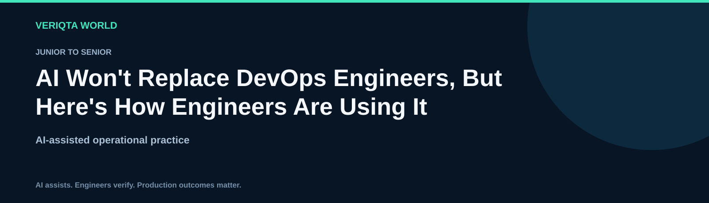

# AI Won't Replace DevOps Engineers, But Here's How Engineers Are Using It

**Junior to Senior · Engineering resource**

Explore practical AI-assisted engineering through context-rich workflows, evidence-based investigation and verified operational decisions. Develop the judgement to review AI output, recognise uncertainty and retain control of engineering changes.

## Learning guides

- [Understanding the engineers role in ai assisted work](chapters/understanding-the-engineers-role-in-ai-assisted-work.md)
- [Recognising ai capabilities and limitations](chapters/recognising-ai-capabilities-and-limitations.md)
- [Learning engineering skills with ai](chapters/learning-engineering-skills-with-ai.md)
- [Using ai for linux operations](chapters/using-ai-for-linux-operations.md)
- [Using ai for shell scripting](chapters/using-ai-for-shell-scripting.md)
- [Using ai for python automation](chapters/using-ai-for-python-automation.md)
- [Using ai for pipeline engineering](chapters/using-ai-for-pipeline-engineering.md)
- [Using ai for infrastructure review](chapters/using-ai-for-infrastructure-review.md)
- [Using ai for kubernetes diagnosis](chapters/using-ai-for-kubernetes-diagnosis.md)
- [Using ai for log analysis](chapters/using-ai-for-log-analysis.md)
- [Using ai for observability](chapters/using-ai-for-observability.md)
- [Using ai for incident response](chapters/using-ai-for-incident-response.md)
- [Using ai for cloud operations](chapters/using-ai-for-cloud-operations.md)
- [Using ai for security review](chapters/using-ai-for-security-review.md)
- [Using ai for sre decisions](chapters/using-ai-for-sre-decisions.md)
- [Using ai for platform workflows](chapters/using-ai-for-platform-workflows.md)
- [Setting boundaries for engineering agents](chapters/setting-boundaries-for-engineering-agents.md)
- [Evaluating ai generated engineering output](chapters/evaluating-ai-generated-engineering-output.md)
- [Strengthening career skills alongside ai](chapters/strengthening-career-skills-alongside-ai.md)
- [Adopting ai responsibly in engineering teams](chapters/adopting-ai-responsibly-in-engineering-teams.md)

## Practice and reference resources

- [Ai and the devops engineer resource guide](ai-and-the-devops-engineer-resource-guide.md)
- [Practical ai and the devops engineer labs](labs/practical-ai-and-the-devops-engineer-labs.md)
- [Ai and the devops engineer failure investigation](labs/ai-and-the-devops-engineer-failure-investigation.md)
- [Cleaning up ai and the devops engineer lab resources](labs/cleaning-up-ai-and-the-devops-engineer-lab-resources.md)
- [Ai and the devops engineer prompt library](prompts/ai-and-the-devops-engineer-prompt-library.md)
- [Ai and the devops engineer production review checklist](checklists/ai-and-the-devops-engineer-production-review-checklist.md)
- [Ai and the devops engineer scenario questions](assessments/ai-and-the-devops-engineer-scenario-questions.md)
- [Ai and the devops engineer answers and explanations](assessments/ai-and-the-devops-engineer-answers-and-explanations.md)
- [Ai and the devops engineer case studies](examples/ai-and-the-devops-engineer-case-studies.md)
- [Ai and the devops engineer references](references/ai-and-the-devops-engineer-references.md)

## Working method

Define the task and environment. Collect and redact evidence. Ask for assumptions and verification steps. Review the proposal, test its behaviour and confirm the outcome. For consequential changes, assess permissions, blast radius and recovery before execution.

[Explore the complete resource catalogue](../../README.md#resource-catalogue)
