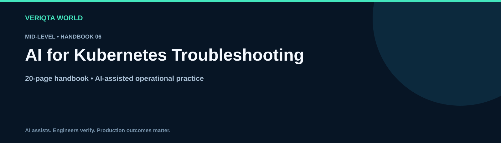

# AI for Kubernetes Troubleshooting

**Mid-Level · 20-page handbook**

Explore practical AI-assisted engineering through context-rich workflows, evidence-based investigation and verified operational decisions. Develop the judgement to review AI output, recognise uncertainty and retain control of engineering changes.

## Learning guides

- [How ai assists kubernetes troubleshooting](chapters/how-ai-assists-kubernetes-troubleshooting.md)
- [Collecting kubernetes investigation evidence](chapters/collecting-kubernetes-investigation-evidence.md)
- [Investigating pending pods with ai](chapters/investigating-pending-pods-with-ai.md)
- [Debugging crashloopbackoff with ai](chapters/debugging-crashloopbackoff-with-ai.md)
- [Reviewing readiness and liveness probes](chapters/reviewing-readiness-and-liveness-probes.md)
- [Investigating services and endpoints](chapters/investigating-services-and-endpoints.md)
- [Troubleshooting kubernetes dns and networking](chapters/troubleshooting-kubernetes-dns-and-networking.md)
- [Investigating persistent storage failures](chapters/investigating-persistent-storage-failures.md)
- [Analysing kubernetes resource pressure](chapters/analysing-kubernetes-resource-pressure.md)
- [Verifying kubernetes recovery](chapters/verifying-kubernetes-recovery.md)

## Practice and reference resources

- [Kubernetes troubleshooting handbook](kubernetes-troubleshooting-handbook.md)
- [Practical kubernetes troubleshooting labs](labs/practical-kubernetes-troubleshooting-labs.md)
- [Kubernetes troubleshooting failure investigation](labs/kubernetes-troubleshooting-failure-investigation.md)
- [Cleaning up kubernetes troubleshooting lab resources](labs/cleaning-up-kubernetes-troubleshooting-lab-resources.md)
- [Kubernetes troubleshooting prompt library](prompts/kubernetes-troubleshooting-prompt-library.md)
- [Kubernetes troubleshooting production review checklist](checklists/kubernetes-troubleshooting-production-review-checklist.md)
- [Kubernetes troubleshooting scenario questions](assessments/kubernetes-troubleshooting-scenario-questions.md)
- [Kubernetes troubleshooting answers and explanations](assessments/kubernetes-troubleshooting-answers-and-explanations.md)
- [Kubernetes troubleshooting case studies](examples/kubernetes-troubleshooting-case-studies.md)
- [Kubernetes troubleshooting references](references/kubernetes-troubleshooting-references.md)

## Working method

Define the task and environment. Collect and redact evidence. Ask for assumptions and verification steps. Review the proposal, test its behaviour and confirm the outcome. For consequential changes, assess permissions, blast radius and recovery before execution.

[Explore the complete handbook catalogue](../../README.md#handbook-catalogue)
