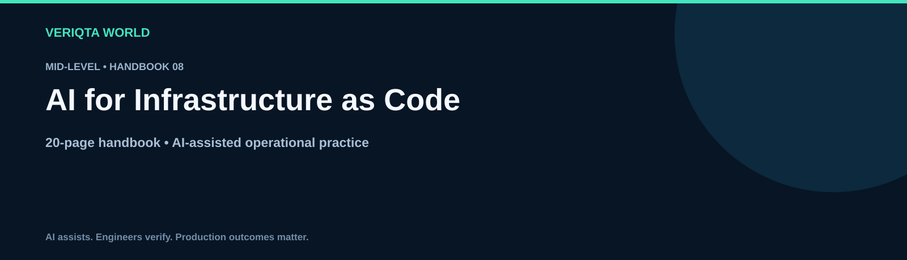

# AI for Infrastructure as Code

**Mid-Level · 20-page handbook**

Explore practical AI-assisted engineering through context-rich workflows, evidence-based investigation and verified operational decisions. Develop the judgement to review AI output, recognise uncertainty and retain control of engineering changes.

## Learning guides

- [How ai assists infrastructure as code](chapters/how-ai-assists-infrastructure-as-code.md)
- [Turning infrastructure requirements into configuration](chapters/turning-infrastructure-requirements-into-configuration.md)
- [Reviewing ai generated infrastructure](chapters/reviewing-ai-generated-infrastructure.md)
- [Designing infrastructure module contracts](chapters/designing-infrastructure-module-contracts.md)
- [Interpreting infrastructure change plans](chapters/interpreting-infrastructure-change-plans.md)
- [Validating infrastructure policy and security](chapters/validating-infrastructure-policy-and-security.md)
- [Investigating state and configuration drift](chapters/investigating-state-and-configuration-drift.md)
- [Analysing infrastructure dependencies](chapters/analysing-infrastructure-dependencies.md)
- [Assessing infrastructure change risk](chapters/assessing-infrastructure-change-risk.md)
- [Planning infrastructure recovery](chapters/planning-infrastructure-recovery.md)

## Practice and reference resources

- [Infrastructure as code handbook](infrastructure-as-code-handbook.md)
- [Practical infrastructure as code labs](labs/practical-infrastructure-as-code-labs.md)
- [Infrastructure as code failure investigation](labs/infrastructure-as-code-failure-investigation.md)
- [Cleaning up infrastructure as code lab resources](labs/cleaning-up-infrastructure-as-code-lab-resources.md)
- [Infrastructure as code prompt library](prompts/infrastructure-as-code-prompt-library.md)
- [Infrastructure as code production review checklist](checklists/infrastructure-as-code-production-review-checklist.md)
- [Infrastructure as code scenario questions](assessments/infrastructure-as-code-scenario-questions.md)
- [Infrastructure as code answers and explanations](assessments/infrastructure-as-code-answers-and-explanations.md)
- [Infrastructure as code case studies](examples/infrastructure-as-code-case-studies.md)
- [Infrastructure as code references](references/infrastructure-as-code-references.md)

## Working method

Define the task and environment. Collect and redact evidence. Ask for assumptions and verification steps. Review the proposal, test its behaviour and confirm the outcome. For consequential changes, assess permissions, blast radius and recovery before execution.

[Explore the complete handbook catalogue](../../README.md#handbook-catalogue)
