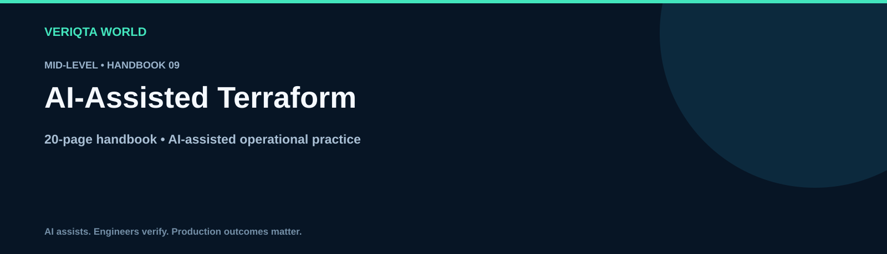

# AI-Assisted Terraform

**Mid-Level · 20-page handbook**

Explore practical AI-assisted engineering through context-rich workflows, evidence-based investigation and verified operational decisions. Develop the judgement to review AI output, recognise uncertainty and retain control of engineering changes.

## Learning guides

- [How ai assists terraform](chapters/how-ai-assists-terraform.md)
- [Providing terraform provider and version context](chapters/providing-terraform-provider-and-version-context.md)
- [Writing terraform configuration with ai](chapters/writing-terraform-configuration-with-ai.md)
- [Reviewing terraform modules](chapters/reviewing-terraform-modules.md)
- [Designing terraform variables and outputs](chapters/designing-terraform-variables-and-outputs.md)
- [Validating ai generated terraform](chapters/validating-ai-generated-terraform.md)
- [Interpreting terraform plans with ai](chapters/interpreting-terraform-plans-with-ai.md)
- [Investigating terraform state problems](chapters/investigating-terraform-state-problems.md)
- [Reviewing terraform imports and drift](chapters/reviewing-terraform-imports-and-drift.md)
- [Planning safe terraform changes](chapters/planning-safe-terraform-changes.md)

## Practice and reference resources

- [Terraform handbook](terraform-handbook.md)
- [Practical terraform labs](labs/practical-terraform-labs.md)
- [Terraform failure investigation](labs/terraform-failure-investigation.md)
- [Cleaning up terraform lab resources](labs/cleaning-up-terraform-lab-resources.md)
- [Terraform prompt library](prompts/terraform-prompt-library.md)
- [Terraform production review checklist](checklists/terraform-production-review-checklist.md)
- [Terraform scenario questions](assessments/terraform-scenario-questions.md)
- [Terraform answers and explanations](assessments/terraform-answers-and-explanations.md)
- [Terraform case studies](examples/terraform-case-studies.md)
- [Terraform references](references/terraform-references.md)

## Working method

Define the task and environment. Collect and redact evidence. Ask for assumptions and verification steps. Review the proposal, test its behaviour and confirm the outcome. For consequential changes, assess permissions, blast radius and recovery before execution.

[Explore the complete handbook catalogue](../../README.md#handbook-catalogue)
