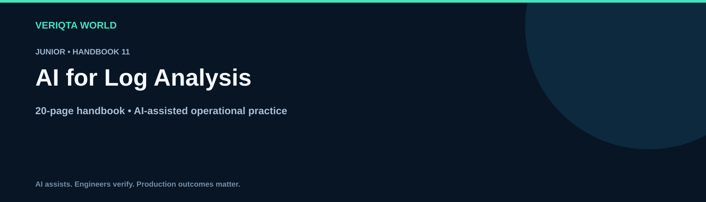

# AI for Log Analysis

**Junior · 20-page handbook**

Explore practical AI-assisted engineering through context-rich workflows, evidence-based investigation and verified operational decisions. Develop the judgement to review AI output, recognise uncertainty and retain control of engineering changes.

## Learning guides

- [How ai assists log analysis](chapters/how-ai-assists-log-analysis.md)
- [Understanding log formats and timestamps](chapters/understanding-log-formats-and-timestamps.md)
- [Redacting sensitive log data](chapters/redacting-sensitive-log-data.md)
- [Writing and verifying log queries](chapters/writing-and-verifying-log-queries.md)
- [Investigating error patterns with ai](chapters/investigating-error-patterns-with-ai.md)
- [Following request and correlation identifiers](chapters/following-request-and-correlation-identifiers.md)
- [Building cross service log timelines](chapters/building-cross-service-log-timelines.md)
- [Testing log based failure hypotheses](chapters/testing-log-based-failure-hypotheses.md)
- [Recognising false positives in log analysis](chapters/recognising-false-positives-in-log-analysis.md)
- [Writing evidence based log summaries](chapters/writing-evidence-based-log-summaries.md)

## Practice and reference resources

- [Log analysis handbook](log-analysis-handbook.md)
- [Practical log analysis labs](labs/practical-log-analysis-labs.md)
- [Log analysis failure investigation](labs/log-analysis-failure-investigation.md)
- [Cleaning up log analysis lab resources](labs/cleaning-up-log-analysis-lab-resources.md)
- [Log analysis prompt library](prompts/log-analysis-prompt-library.md)
- [Log analysis production review checklist](checklists/log-analysis-production-review-checklist.md)
- [Log analysis scenario questions](assessments/log-analysis-scenario-questions.md)
- [Log analysis answers and explanations](assessments/log-analysis-answers-and-explanations.md)
- [Log analysis case studies](examples/log-analysis-case-studies.md)
- [Log analysis references](references/log-analysis-references.md)

## Working method

Define the task and environment. Collect and redact evidence. Ask for assumptions and verification steps. Review the proposal, test its behaviour and confirm the outcome. For consequential changes, assess permissions, blast radius and recovery before execution.

[Explore the complete handbook catalogue](../../README.md#handbook-catalogue)
