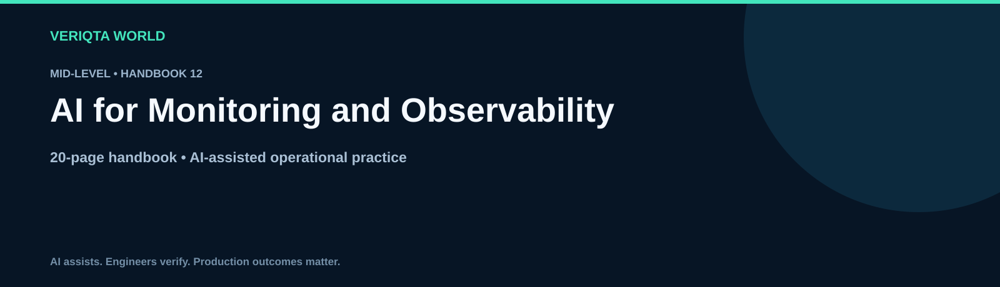

# AI for Monitoring and Observability

**Mid-Level · 20-page handbook**

Explore practical AI-assisted engineering through context-rich workflows, evidence-based investigation and verified operational decisions. Develop the judgement to review AI output, recognise uncertainty and retain control of engineering changes.

## Learning guides

- [How ai assists observability](chapters/how-ai-assists-observability.md)
- [Reviewing telemetry coverage](chapters/reviewing-telemetry-coverage.md)
- [Interpreting service metrics with ai](chapters/interpreting-service-metrics-with-ai.md)
- [Correlating logs metrics and traces](chapters/correlating-logs-metrics-and-traces.md)
- [Investigating distributed traces](chapters/investigating-distributed-traces.md)
- [Reviewing operational dashboards](chapters/reviewing-operational-dashboards.md)
- [Improving alert quality with ai](chapters/improving-alert-quality-with-ai.md)
- [Analysing slis and slos](chapters/analysing-slis-and-slos.md)
- [Investigating telemetry cardinality and cost](chapters/investigating-telemetry-cardinality-and-cost.md)
- [Validating observability improvements](chapters/validating-observability-improvements.md)

## Practice and reference resources

- [Observability handbook](observability-handbook.md)
- [Practical observability labs](labs/practical-observability-labs.md)
- [Observability failure investigation](labs/observability-failure-investigation.md)
- [Cleaning up observability lab resources](labs/cleaning-up-observability-lab-resources.md)
- [Observability prompt library](prompts/observability-prompt-library.md)
- [Observability production review checklist](checklists/observability-production-review-checklist.md)
- [Observability scenario questions](assessments/observability-scenario-questions.md)
- [Observability answers and explanations](assessments/observability-answers-and-explanations.md)
- [Observability case studies](examples/observability-case-studies.md)
- [Observability references](references/observability-references.md)

## Working method

Define the task and environment. Collect and redact evidence. Ask for assumptions and verification steps. Review the proposal, test its behaviour and confirm the outcome. For consequential changes, assess permissions, blast radius and recovery before execution.

[Explore the complete handbook catalogue](../../README.md#handbook-catalogue)
