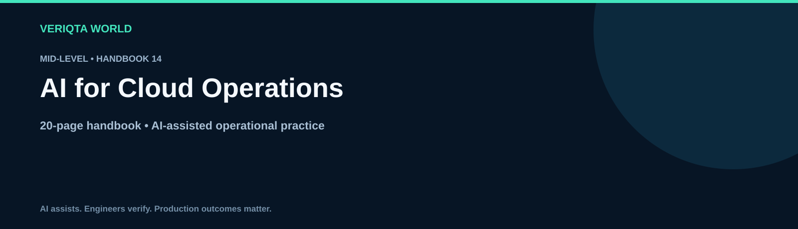

# AI for Cloud Operations

**Mid-Level · 20-page handbook**

Explore practical AI-assisted engineering through context-rich workflows, evidence-based investigation and verified operational decisions. Develop the judgement to review AI output, recognise uncertainty and retain control of engineering changes.

## Learning guides

- [How ai assists cloud operations](chapters/how-ai-assists-cloud-operations.md)
- [Providing cloud account and region context](chapters/providing-cloud-account-and-region-context.md)
- [Investigating cloud compute problems](chapters/investigating-cloud-compute-problems.md)
- [Reviewing cloud identity and access](chapters/reviewing-cloud-identity-and-access.md)
- [Troubleshooting cloud networking](chapters/troubleshooting-cloud-networking.md)
- [Investigating cloud storage and backups](chapters/investigating-cloud-storage-and-backups.md)
- [Diagnosing managed service failures](chapters/diagnosing-managed-service-failures.md)
- [Analysing cloud costs with ai](chapters/analysing-cloud-costs-with-ai.md)
- [Reviewing cloud quotas and capacity](chapters/reviewing-cloud-quotas-and-capacity.md)
- [Planning and verifying cloud changes](chapters/planning-and-verifying-cloud-changes.md)

## Practice and reference resources

- [Cloud operations handbook](cloud-operations-handbook.md)
- [Practical cloud operations labs](labs/practical-cloud-operations-labs.md)
- [Cloud operations failure investigation](labs/cloud-operations-failure-investigation.md)
- [Cleaning up cloud operations lab resources](labs/cleaning-up-cloud-operations-lab-resources.md)
- [Cloud operations prompt library](prompts/cloud-operations-prompt-library.md)
- [Cloud operations production review checklist](checklists/cloud-operations-production-review-checklist.md)
- [Cloud operations scenario questions](assessments/cloud-operations-scenario-questions.md)
- [Cloud operations answers and explanations](assessments/cloud-operations-answers-and-explanations.md)
- [Cloud operations case studies](examples/cloud-operations-case-studies.md)
- [Cloud operations references](references/cloud-operations-references.md)

## Working method

Define the task and environment. Collect and redact evidence. Ask for assumptions and verification steps. Review the proposal, test its behaviour and confirm the outcome. For consequential changes, assess permissions, blast radius and recovery before execution.

[Explore the complete handbook catalogue](../../README.md#handbook-catalogue)
